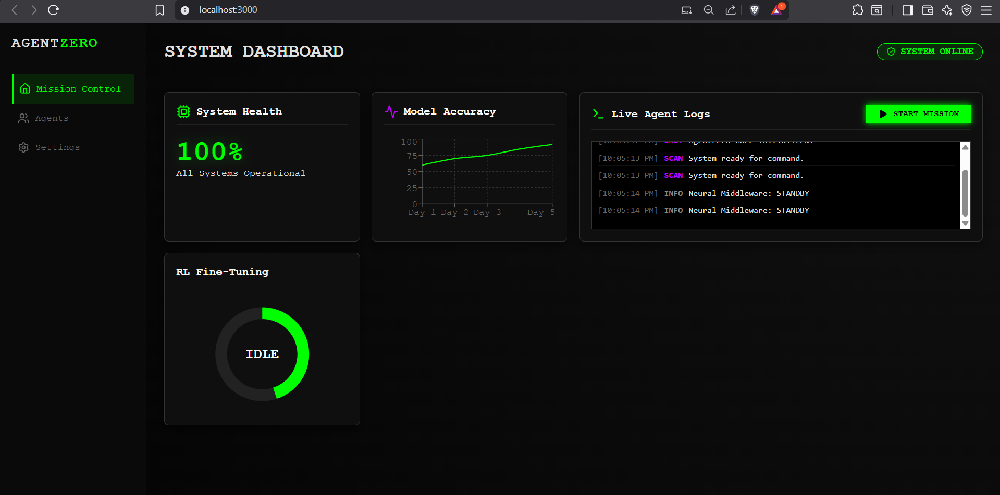
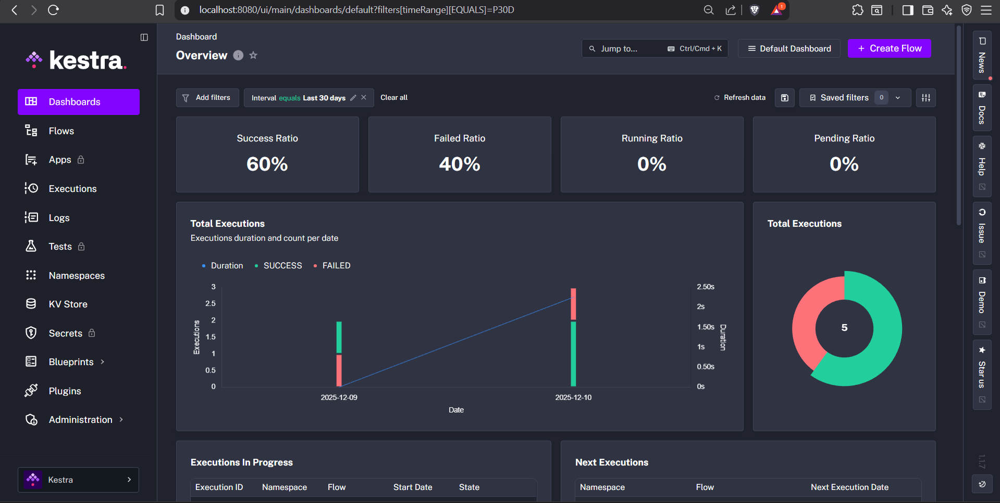
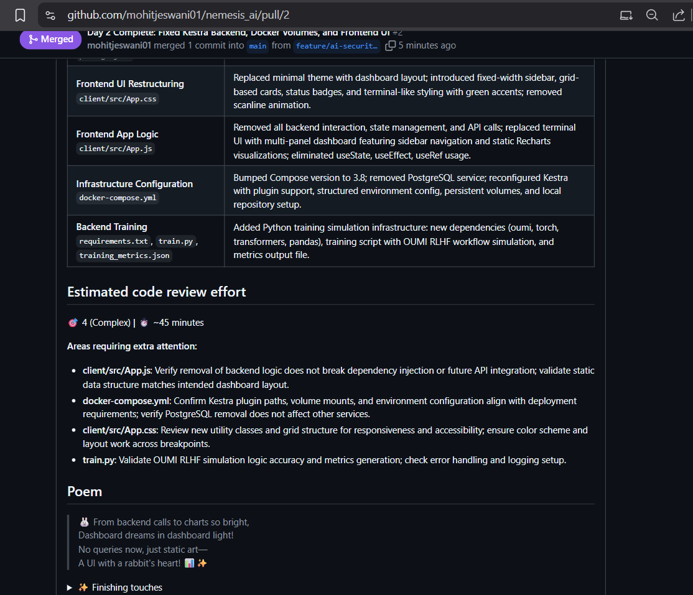
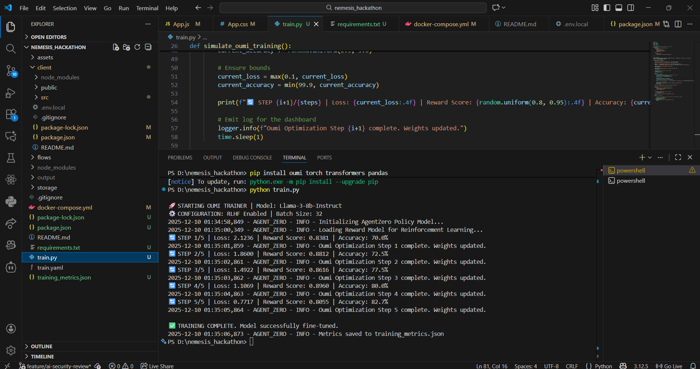
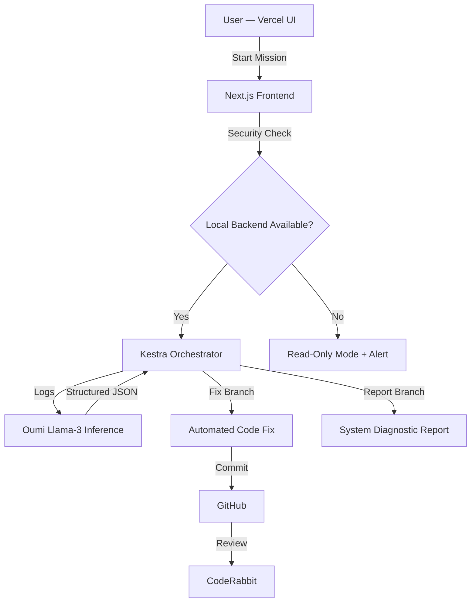

# ⚡ AgentZero — Autonomous Ops Layer for Real-World AI Execution
> **“Most agents talk. AgentZero acts.”**



AgentZero is an **Autonomous Operational Loop** that transforms AI from a text generator into a **real-world operator**.  
It closes the gap between *reasoning → execution → validation → correction*, enabling safe, multi-step automation that actually works in practice.

AgentZero integrates **Kestra, Oumi, Cline, CodeRabbit, and Vercel** to build a complete end-to-end autonomous system.

---

# 🌍 Why AgentZero Exists (Impact)

Traditional AI agents fail because:
- They cannot safely **execute** real operations  
- They cannot **orchestrate** multi-step tasks  
- They cannot **self-correct**  

AgentZero solves these limitations through:
- **Kestra** for decision-making and workflow orchestration  
- **Oumi (Llama-3)** for structured reasoning  
- **Cline** for autonomous local fixes  
- **CodeRabbit** for safety & code review  
- **Vercel UI** for a secure, user-friendly interface  

This makes AgentZero practical for DevOps, debugging, CI/CD automation, and real infrastructure tasks.

---

# 🧠 Core Components & How They Work

## 1. Kestra — The Orchestration Brain


Kestra handles:
- Log ingestion  
- AI inference calls  
- Conditional branching (Fix / Report)  
- Execution workflows  
- Autonomous loops and triggers  

It acts as the **control center** for all agentic decisions.

---

## 2. Cline — The Autonomous Builder

Cline operates locally to:
- Scaffold backend code  
- Fix errors autonomously  
- Run tests and debug issues  
- Handle git commits  
- Iterate without manual intervention  

This allows AgentZero to **improve itself** through real execution cycles.

---

## 3. CodeRabbit — Automated QA & Safety


Every commit produced by the agent loop:
- Opens a PR  
- Gets reviewed by CodeRabbit  
- Receives bug warnings, documentation suggestions, and safety checks  

This ensures quality and prevents unsafe merges.

---

## 4. Oumi — The Intelligence Layer


Oumi (Llama-3) converts:
**Raw logs → structured JSON → precise commands**

Capabilities:
- Intent detection  
- Error reasoning  
- Safety validation  
- Generating deterministic agent actions  

This gives AgentZero interpretability and reliability.

---

## 5. Vercel — Secure Frontend Layer

Frontend is deployed on Vercel with:
- **Instant global access**  
- **No cold starts**  
- **Hybrid Security Mode**  

If backend is unreachable → UI enters **read-only secure mode**.  
If backend is available → full autonomous operation.

This prevents unsafe remote execution.

---

# 🧠 System Architecture


---
# 🛠️ Installation & Setup Guide

This section explains exactly how to **clone the repo**, **start Kestra**, and **run the frontend** so that judges and users can reproduce AgentZero locally in under 10 minutes.

---

# ✔️ Prerequisites

Make sure you have the following installed:

| Tool | Version |
|------|---------|
| **Node.js** | ≥ 18.x |
| **NPM** | ≥ 8.x |
| **Python** | ≥ 3.10 |
| **Docker** | Latest |
| **Docker Compose** | Latest |
| **Git** | Latest |

---

# 📥 1. Clone the Repository

```bash
git clone https://github.com/mohitjeswani01/nemesis_ai.git
cd nemesis_ai
```

