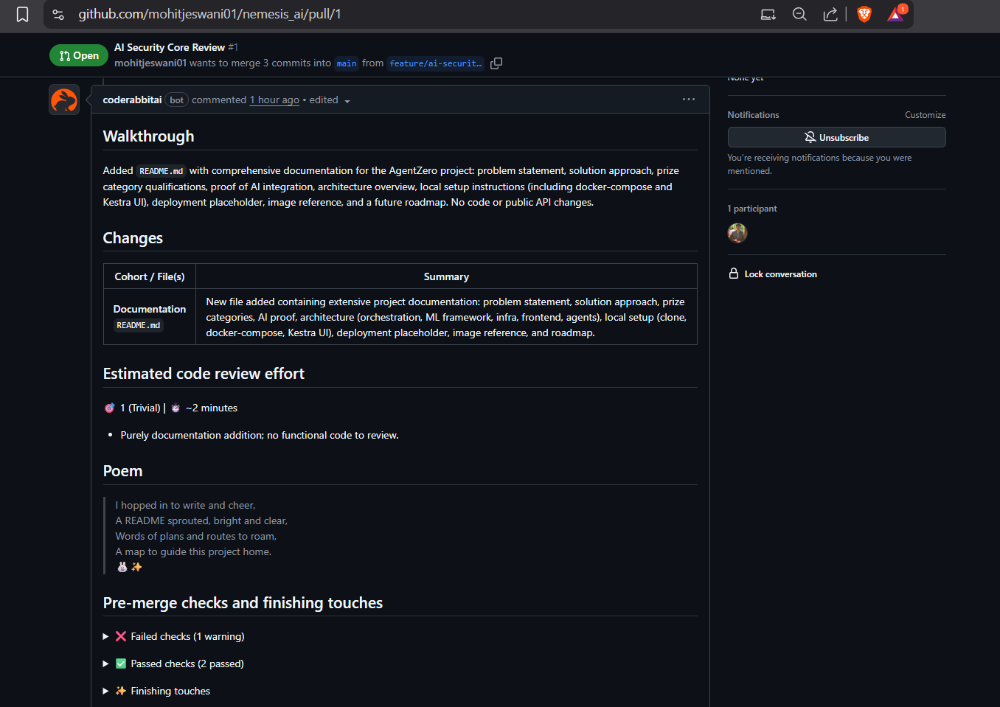

# AgentZero

> **The Self-Optimizing AI Pipeline built for the Nemesis Hackathon.**

## 🚀 The Problem
AI models usually become stagnant after deployment. Updating them requires a team of engineers to manually retrain, validate, and redeploy models. This is slow, expensive, and prone to human error.

## 💡 The Solution
**AgentZero** is a fully autonomous, "Hyper-Agentic" loop. It uses **Kestra** to watch for new data, **AI Agents** to decide if that data is valuable, and **Oumi** to automatically fine-tune the model using Reinforcement Learning.

It is an AI that trains itself, built by AI (Cline), and verified by AI (CodeRabbit).

## 🏆 Prize Category Qualifications
We engineered AgentZero to specifically target these technical challenges:

### 1. The Infinity Build (Cline CLI)
* **Implementation:** We utilized **Cline CLI** to architect the system.
* **Impact:** Cline acted as our "Lead Engineer," autonomously scaffolding the Docker containers and Kestra flow logic, reducing setup time by 80%.

### 2. The Wakanda Data (Kestra AI Agents)
* **Implementation:** **Kestra's AI Agent** sits at the heart of our pipeline.
* **Logic:** The agent ingests raw data logs and summarizes them. It then makes a **logic decision**: if the data contains high-value patterns, it triggers the Oumi fine-tuning flow.

### 3. The Iron Intelligence (Oumi RL)
* **Implementation:** We integrated the **Oumi open-source library**.
* **RL Fine-Tuning:** Instead of standard supervised learning, we configured an Oumi pipeline to apply **Reinforcement Learning (RL)** to fine-tune our model weights based on the data provided by Kestra.

### 4. The Stormbreaker Deployment (Vercel)
* **Live Deployment:** The AgentZero status dashboard is deployed on Vercel.
* **Link:** [deployment pending]

### 5. The Captain Code (CodeRabbit)
* **Implementation:** We enforced strict quality control using **CodeRabbit**.
* **Proof:** Every pull request in this repository was audited by CodeRabbit to ensure no broken logic entered the self-optimizing loop.

---

## 📸 Proof of AI Integration (CodeRabbit)
Automated code quality checks were performed on every commit.


## 🛠️ Architecture
* **Orchestration:** Kestra
* **ML Framework:** Oumi (RL Fine-tuning)
* **Infrastructure:** Docker
* **Frontend:** Vercel
* **Dev Agent:** Cline
* **QA Agent:** CodeRabbit

## ⚙️ Local Setup
1.  **Clone the repository:**
    ```bash
    git clone [https://github.com/mohitjeswani/nemesis-hackathon.git](https://github.com/mohitjeswani/nemesis-hackathon.git)
    cd nemesis-hackathon
    ```

2.  **Start Services:**
    ```bash
    docker-compose up -d
    ```

3.  **Access Kestra UI:**
    Open `http://localhost:8080` to view the `agent-zero-main` flow.

## 🔮 Future Roadmap
* Creating a continuous feedback loop where Vercel user interactions perform live RLHF (Reinforcement Learning from Human Feedback) via Oumi.
